# ClipNest

跨设备文本剪贴板。在一台设备粘贴，在另一台设备一键复制。

不用再把命令、配置片段、临时文本发给自己的微信，再到另一台电脑上登录一遍了。

## 功能

- 🔐 邀请码注册 + JWT 登录，多设备常驻 30 天
- 📁 多层文件夹，像文件管理器一样组织内容（`项目 / 配置 / ...`）
- 📋 一键复制，卡片右上角点一下就进剪贴板
- 🔍 跨文件夹搜索、置顶常用条目
- 🔄 自动轮询同步，一边保存另一边几秒内出现
- 🤝 分享给指定账号（对方可选择存入自己的库），或生成公开只读链接
- 🛠 管理员面板：动态邀请码、注册开关、用户管理
- 🎨 Claude Code 风格配色，深色 / 浅色双主题

## 界面

> 以下截图均为演示数据。

### 登录 / 注册

注册需要邀请码，邀请码每 10 分钟轮换一次。

| 登录 | 注册 |
|---|---|
| 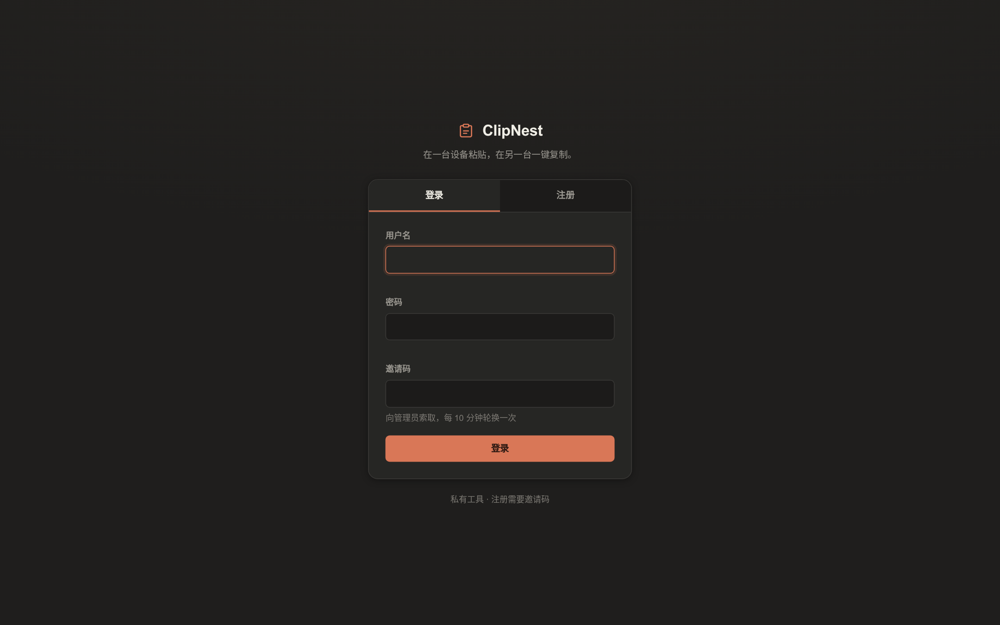 | 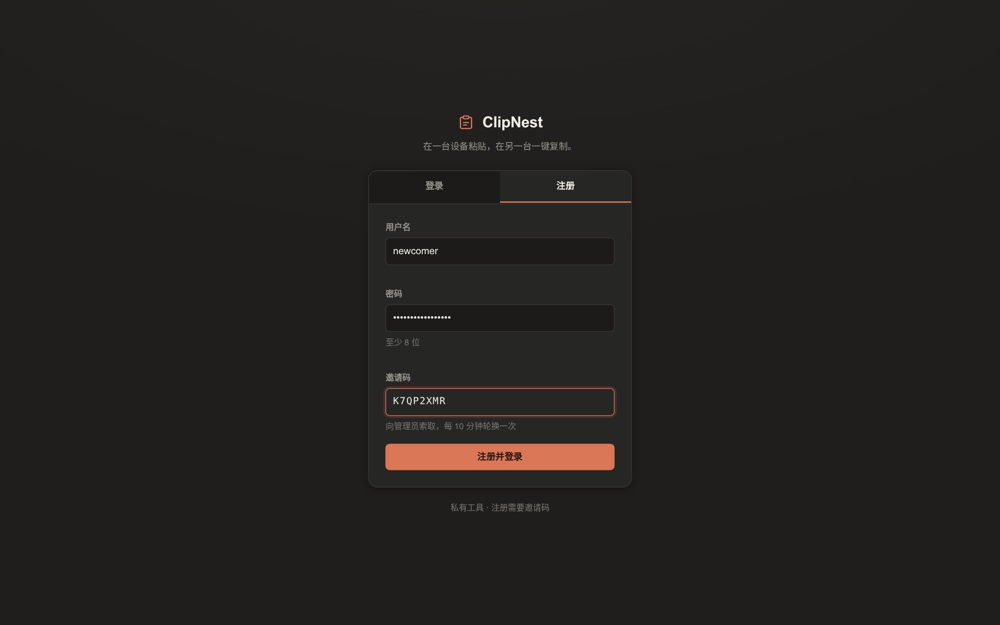 |

### 主界面

左边文件夹树（计数含子文件夹），右边卡片网格，每张卡片右上角一键复制。置顶的排在最前。

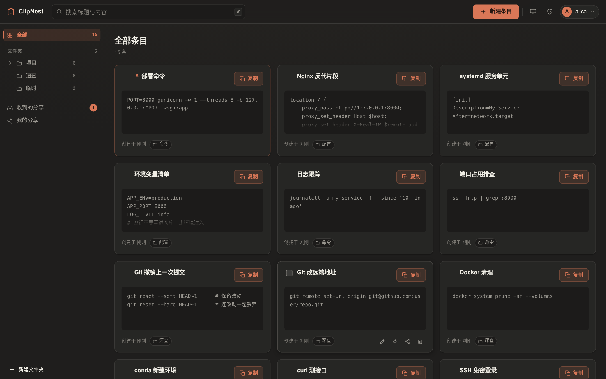

### 文件夹

进到某个文件夹后，右上角有一个只在本文件夹里搜的输入框，不用回到顶栏。

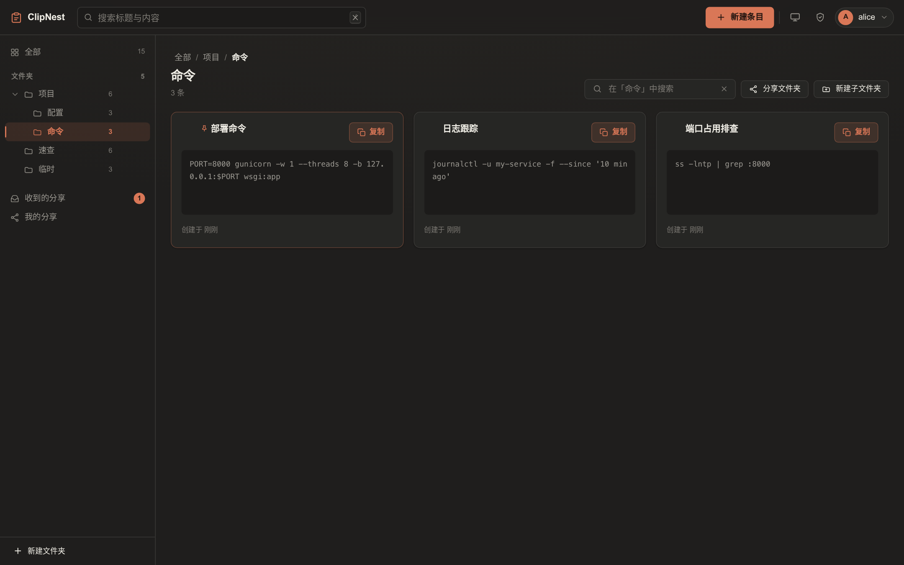

### 搜索

顶栏搜索跨所有文件夹，标题和内容一起匹配。

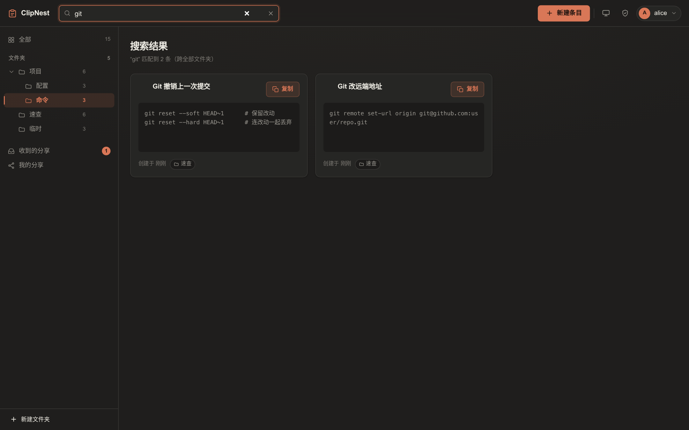

### 新建与查看

标题留空会用默认标题。内容长的时候卡片只显示开头，点一下看全文。

| 新建条目 | 查看全文 |
|---|---|
| 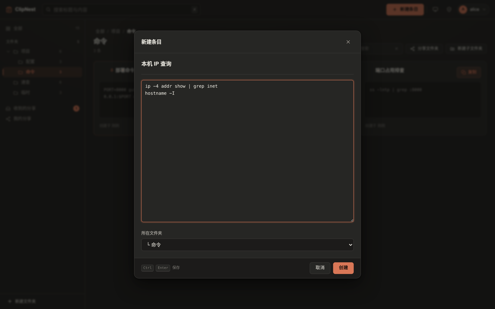 | 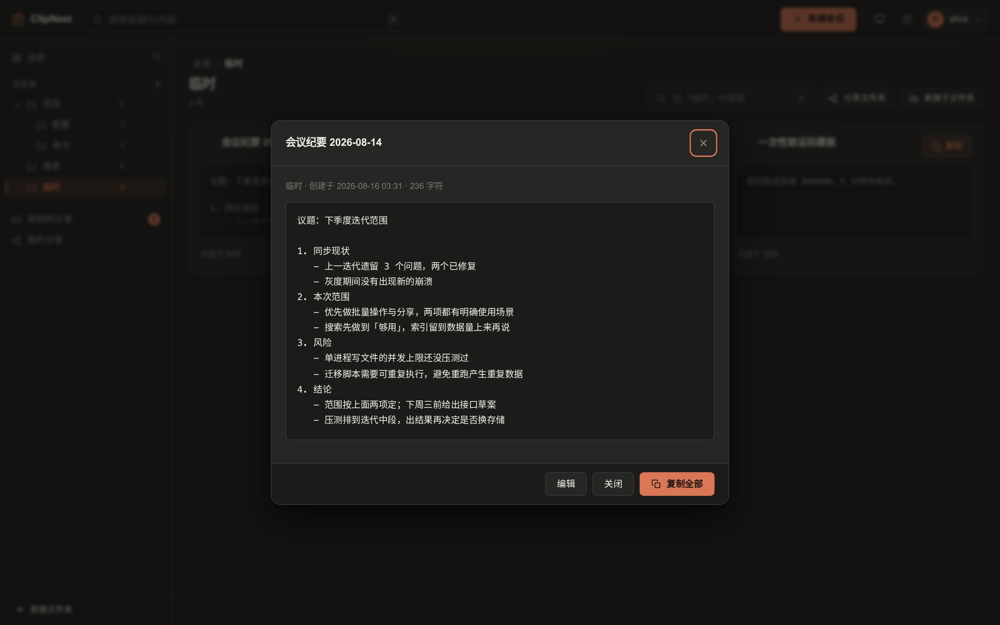 |

### 批量选择

勾选多条后可以一次移动到别的文件夹。

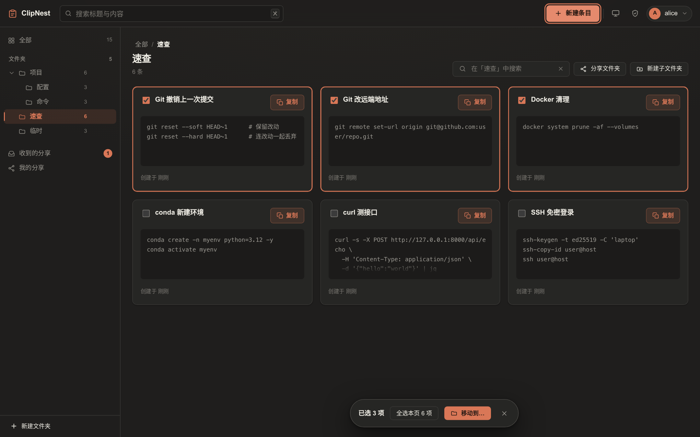

### 分享

两种方式：发给某个账号（对方收到的是快照，你之后的修改不影响它），或者生成一条公开只读链接。

| 发给用户 | 公开链接 |
|---|---|
| 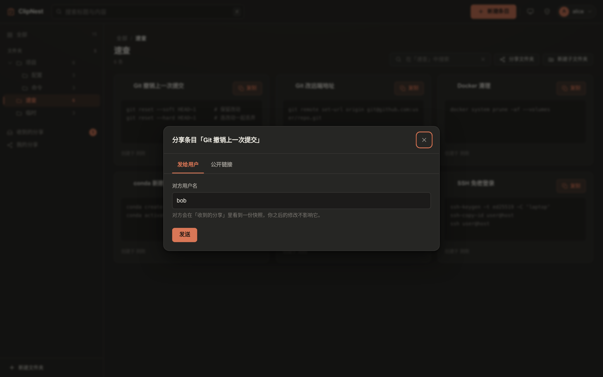 |  |

| 收到的分享 | 我的分享 |
|---|---|
| 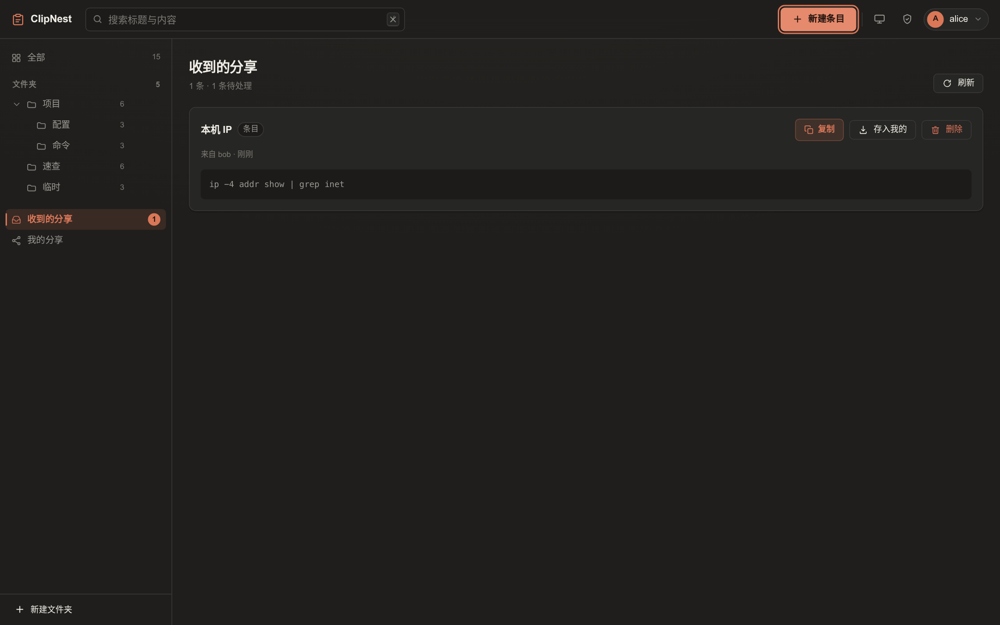 | 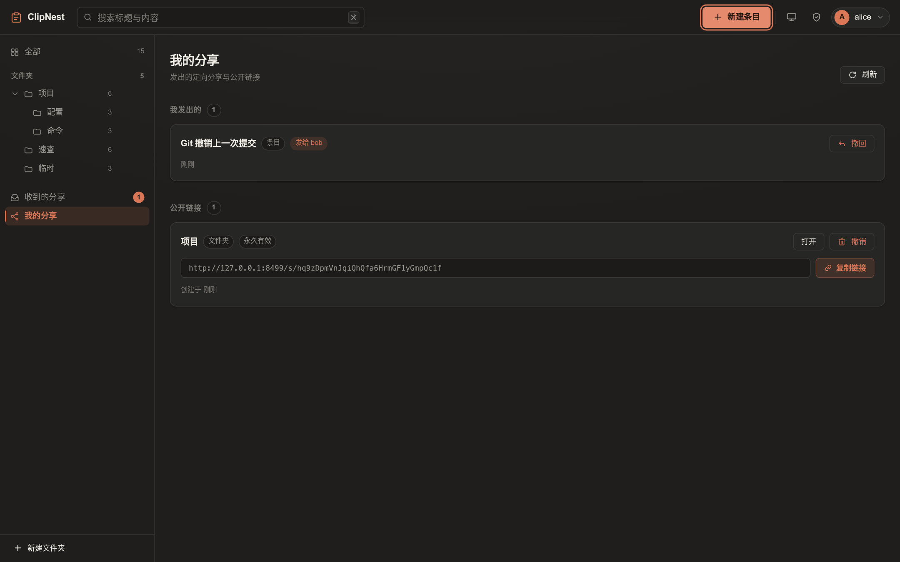 |

### 公开分享页

拿到链接的人不用登录。分享整个文件夹时，左边是目录树，右边按层级分组显示。

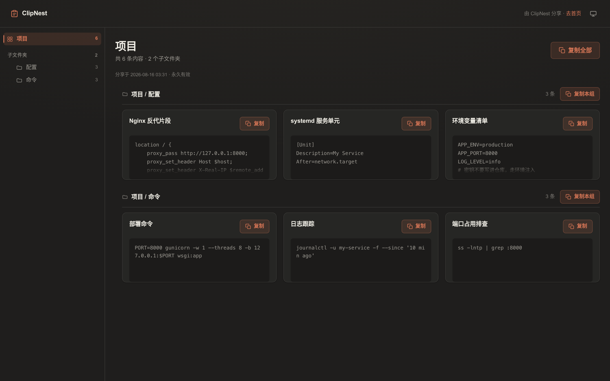

### 管理员面板

当前邀请码（截图里打了码）、注册开关、用户管理：禁用、重置密码、删除。

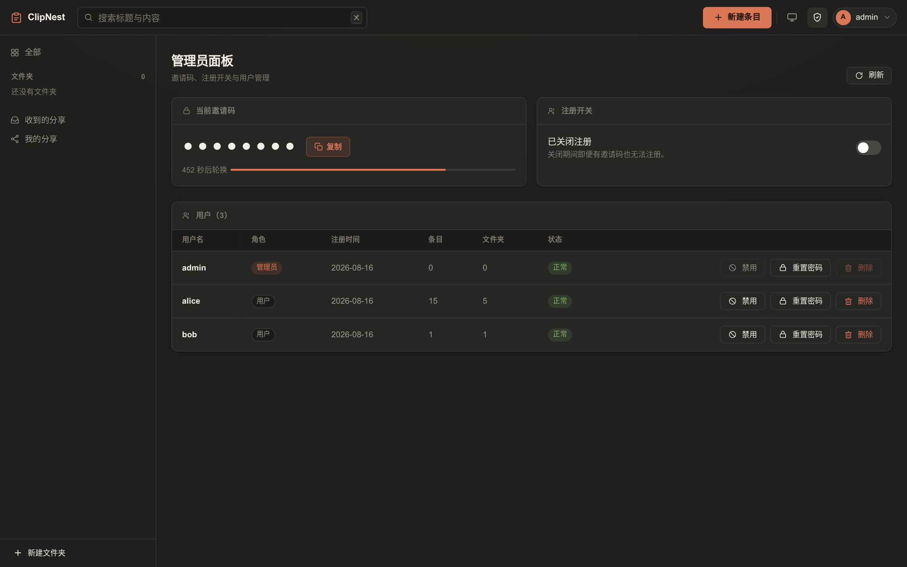

### 浅色主题与窄屏

跟随系统，也可以手动切换。窄屏下侧栏收成抽屉。

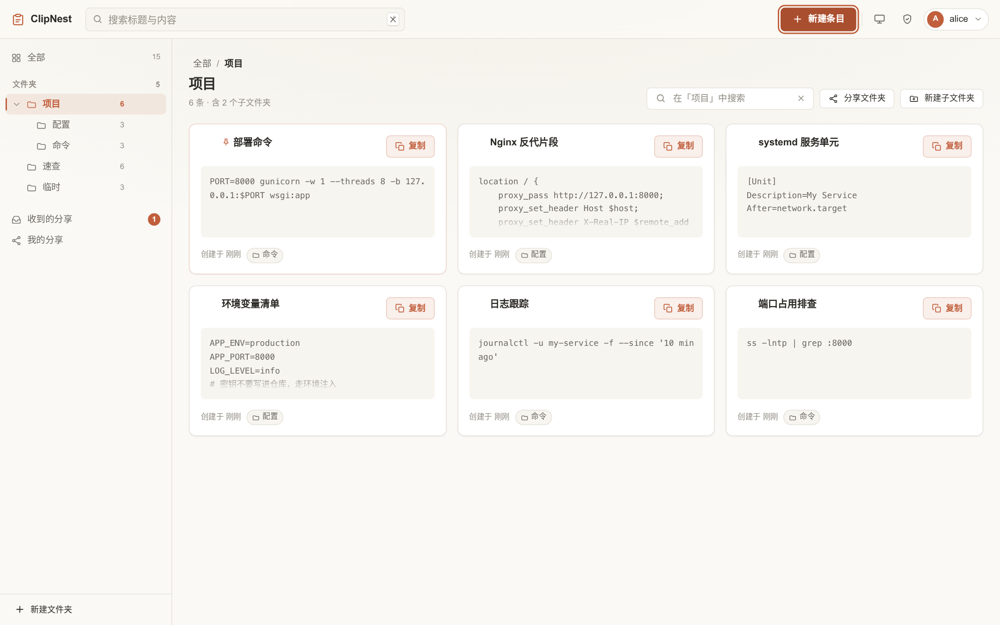

| 窄屏 | 抽屉 |
|---|---|
| 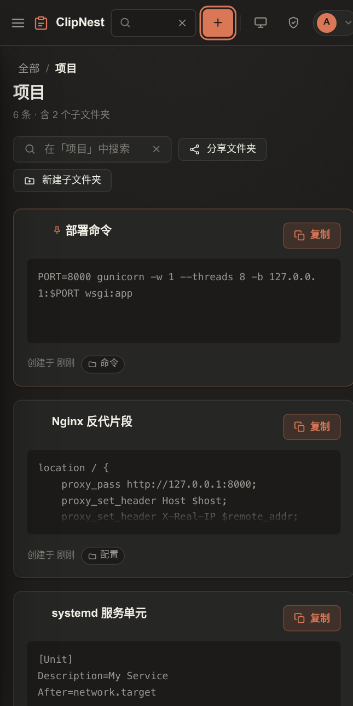 | 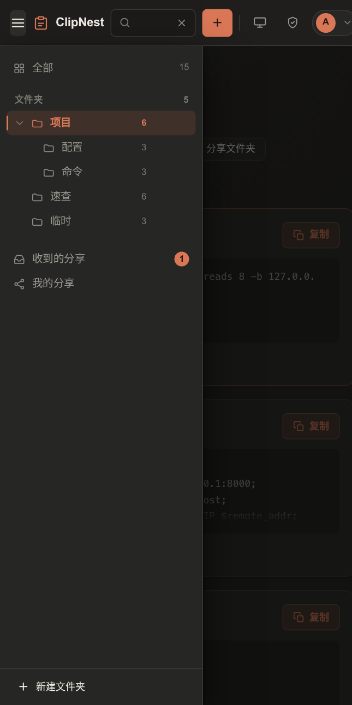 |

## 技术栈

Flask + PyJWT，文件即数据库（JSON + fcntl 锁 + 原子替换），原生前端无构建步骤。

## 快速开始

```bash
# 1. 创建环境
conda create -n clipsync python=3.12 -y
conda activate clipsync
pip install -r requirements.txt

# 2. 启动
./run.sh
```

首次启动会自动：

- 生成 `data/config.json`（内含 JWT 与邀请码密钥）
- 创建管理员账号 `admin`，随机密码打印到控制台并写入 `data/ADMIN_PASSWORD.txt`


## 文档

- [设计文档](docs/DESIGN.md) — 架构、模块划分、关键机制
- [API 契约](docs/API.md) — 完整接口定义与数据结构

## 测试

```bash
pytest
```

